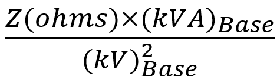
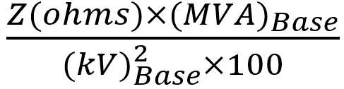
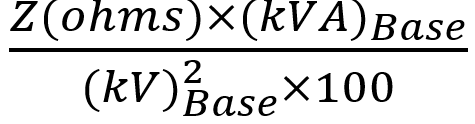

## Q1. The per unit impedance Zpu is given by  

a)  

b)  

c)  

d) 

## Q2. What does the Y-Bus matrix represent in power system analysis 

a) Impedance between buses.  
b) Admittance between buses.   
c) Power flow between buses.  
d) Voltage levels at buses.  

## Q3. The per unit value of a 2 ohm resistor at 100 MVA base and 10 kV base is  

a) 4 per unit.  
b) 2 per unit.   
c) 0.5 per unit.  
d) 0.25 per unit.  

## Q4. If number of buses in a power system network is \( P \), then the number of Y-Bus elements is 

a) \( 2P \)  
b) \( 4P \)  
c) \( P^2 \)   
d) \( P^4 \)  

## Q5. Before calculating the Y-Bus matrix, which of the following information must be known 

a) The load demands at each bus.  
b) The reactive power generation at each bus.  
c) The thermal limits of all transmission lines.  
d) The line impedances or admittances of transmission lines and transformers.   

 
